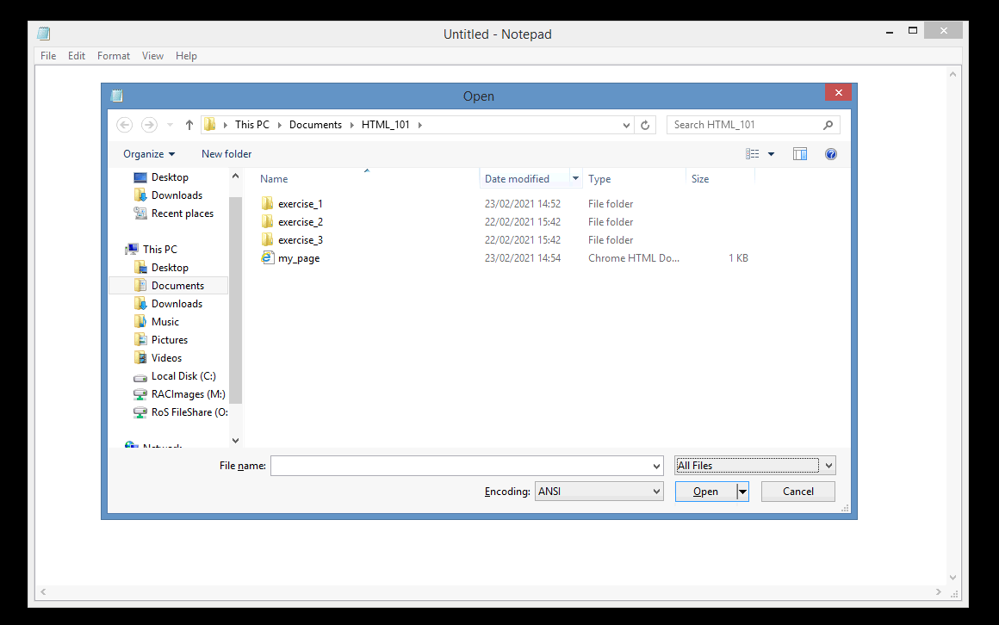
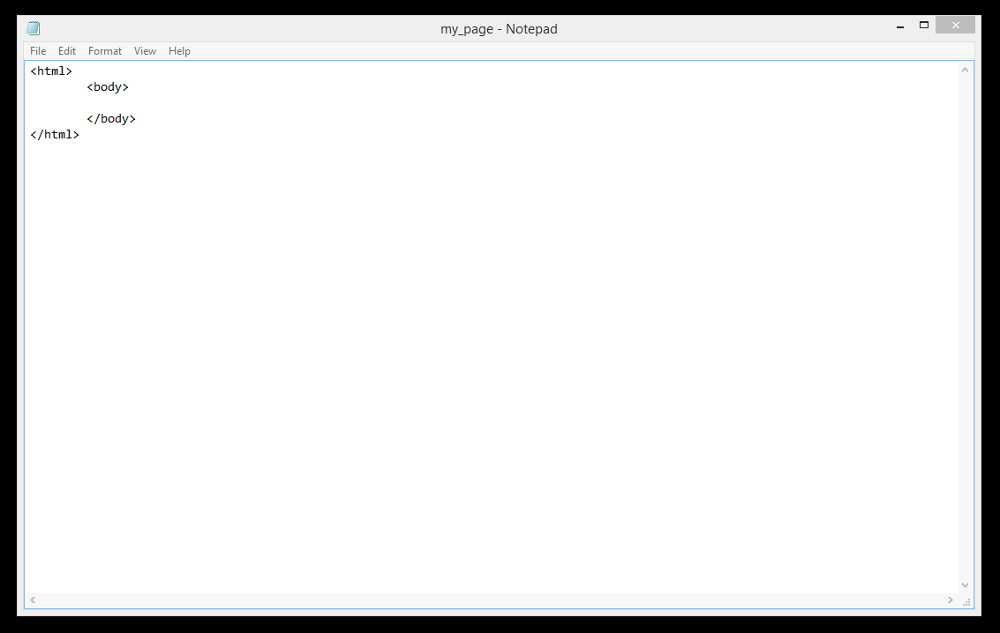
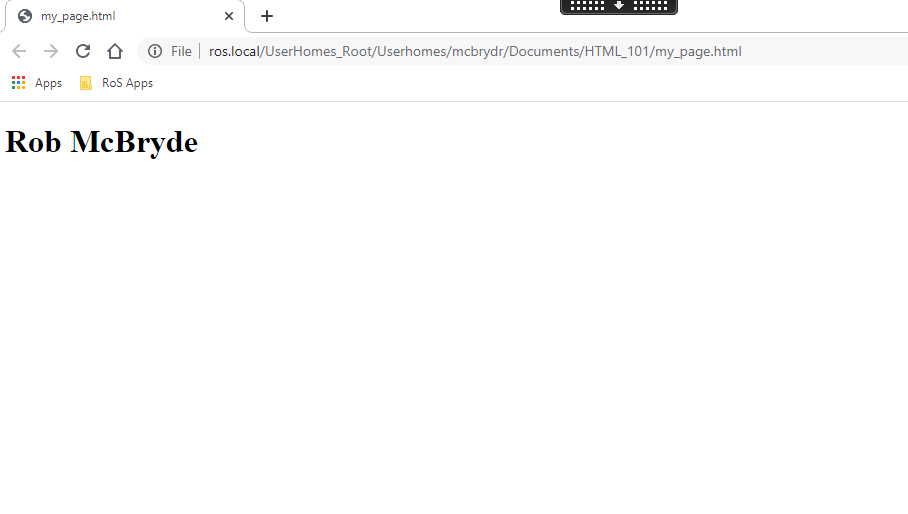

# Tags and Elements
 
HTML enables us to "markup" our content to give it a meaningful structure. An HTML element is defined by an opening tag, some content, and a closing tag:
 ```html
<tagname>Content goes here...</tagname>
 ```
Some examples of HTML elements:
 
 ```html
<h1>My first heading</h1>
<p>My first paragraph</p>
 ```

| Start Tag        | Content           | End Tag  |
|:-------------|:-------------:| -----:|
| `<h1>`     | My first heading | `</h1>` |
| `<p>`      | My first paragraph      |   `</p>` |
|  `<hr>`          |    *none*                     | *none*        |


>Some HTML elements have no content (like the `<hr>` element). 
These elements are called empty elements and don't have an end tag, we'll cover these later.
 
 ---


## Exercise 1 

Open the 'my_page.html' found in the 'exercises' folder by double clicking it. By default Windows will suggest the file is opened with a Web Browser as it has an ‘.html’ extension. In order for us to edit the raw HTML, we have to open the file with a plain text editor such as Notepad. 

Open Notepad and select ‘Open’ from the ‘File’ menu. In the new window that appears navigate into the ‘HTML_101’ folder. By default you won’t see the ‘my_page.html’ as Notepad is only looking for Text Documents (*.txt). Change this via the drop down in the bottom right of the window to look for ‘All Files’. 



Select the ‘my_page.html’ file to view our raw HTML markup code in Notepad. It should look something like this:



Our entire web page needs to be wrapped in <html> tags. The actual <html> text is called an “opening tag”, while </html> is called a “closing tag”. Everything inside of these tags are considered part of the <html> “element”, which is this ethereal thing that gets created when a web browser parses your HTML tags.

```html
<html>
    <body>
       
    </body>
</html>
```

The `<body>` tags wrap the visible elements in our web page. Anything you put between the opening and closing body tags will be displayed to the end user.


Let’s start by adding a heading containing your name. 
HTML provides six levels of heading, and the corresponding elements are `<h1>`, `<h2>`, `<h3>`,…`<h6>`. The higher the number, the less prominent the heading. 

The first heading on a page should typically be a `<h1>`, so let’s add one containing your name between the `<body>` opening and closing tags:

```html
<h1>Your Name</h1>
```

Your HTML should look something like this (the spacing is not mandatory and is ignored by the Web Browser but its good practice to help keep your code clean and easier to read as it grows in size):

```html
<html>
    <body>
        <h1>Rob McBryde</h1>
    </body>
</html>
```
 
 
Save the changes you have made to the file in Notepad via ‘Save’ in the ‘File’ menu. **Do not** use ‘save as’ as it may change the file extension from html to txt.

Now in your File Explorer, double click your ‘my_file.html’ file, this will open it in your default Web Browser to see our changes. You should see your name displayed as a heading:

  


---

## Troubleshooting

### Heading not visible

If you aren't seeing your heading, carefully check your HTML tags are nested in the correct order. It's important to ensure there are no overlapping elements. 
For instance, the `<h1>` element is supposed to be inside of the `<body>`, so you never want to add the closing `</body>` tag before closing the `</h1>` tag.

e.g. (DON'T EVER DO THIS)
```html
<body>
    <h1>Rob McBryde</body>
</h1>
```


---

### HTML opens in Notepad rather than Web Browser

If you double click you file to open it with a Web Browser and it opens as the raw HTML code in Notepad, make sure when you save your file you retain the ‘.html’ file extension. 

After making changes to your ‘my_page.html’ file, if you choose ‘save as’ make sure you change the ‘Save as type’ drop down to ‘All Files’ rather than ‘Text Documents (*.txt)’. Otherwise you will change the file extension from html to txt and your Web Browser won’t attempt to open the file. 
