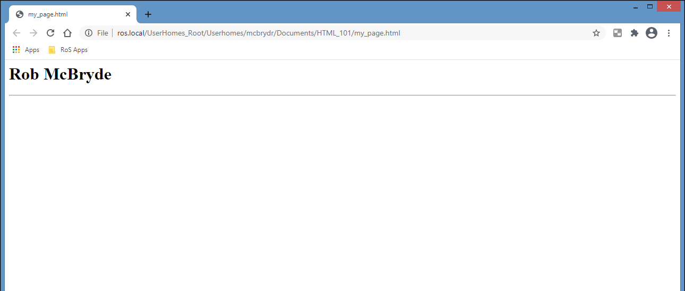
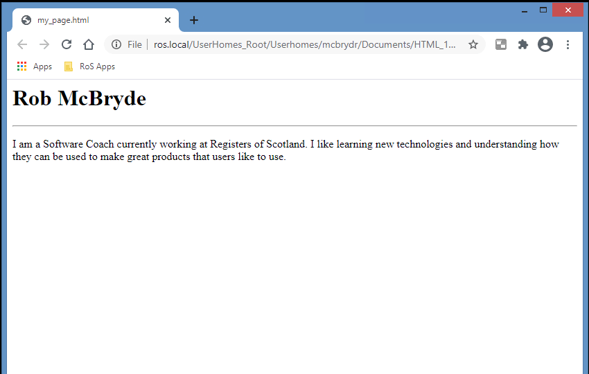

# Exercise 2 

Now we have a main heading for our page let’s add a paragraph of text about yourself. 

Open your ‘my_page.html’ code once more in Notepad and we will add a horizontal rule below our heading to visually separate the content. 

There are certain HTML elements that only consist of a single tag without content, or a closing tag. The Horizontal Rule element is one of these. Add the following tag within the body tags, underneath our heading:
```html
<hr>
```
Your HTML should look something like this (the spacing is not mandatory and is ignored by the Web Browser but its good practice to help keep you code clean and easier to read as it grows in size):
```html
<html>
    <body>
        <h1>Rob McBryde</h1>
        <hr>
    </body>
</html>
```
 
Save the file and open the 'my_page.html' file in your Web Browser:

  

## Adding a Paragraph

Now add a paragraph about yourself using the in `<p>` element. 

The `<p>` element marks all the text inside it as a distinct paragraph. Populate yours with a statement introducing yourself (make sure it is placed within your body tags, below the horizontal rule):

```html
<p>I am a Software Coach currently working at Registers of Scotland. I like learning new technologies and understanding how they can be used to make great products that users like to use.</p>
```

Save your code and inspect your changes in your Web Browser. Notice that when you resize the width of the window, your horizontal line and paragraph automatically adapt their layout. 

  