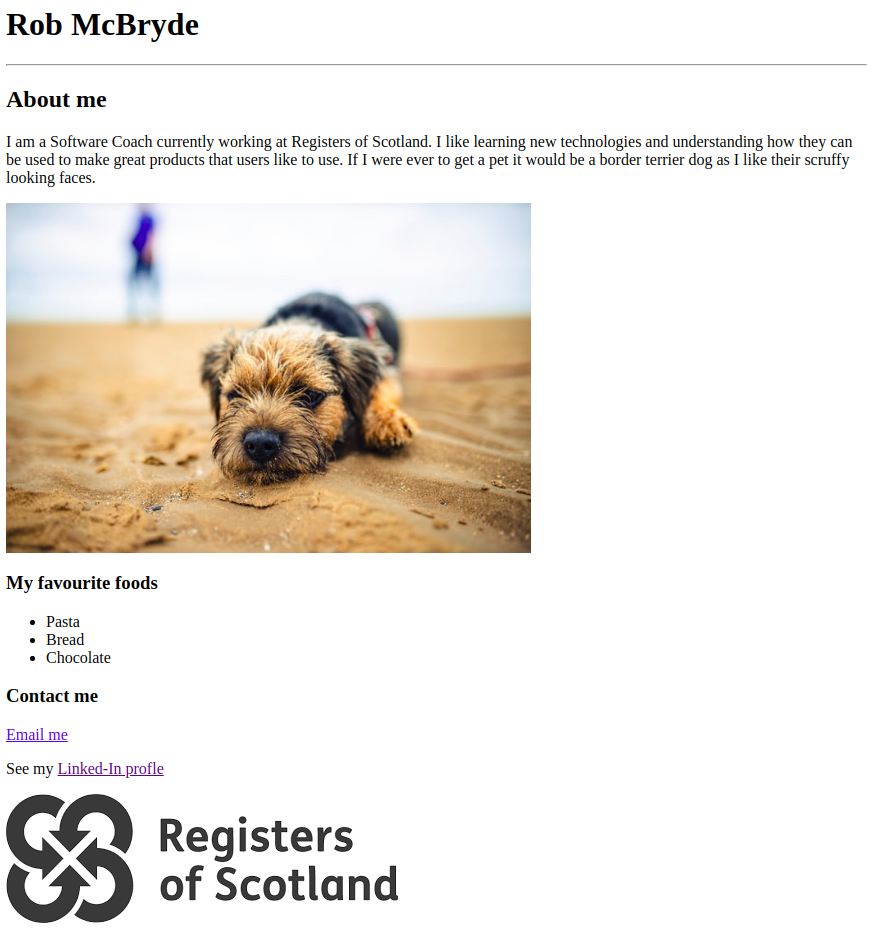
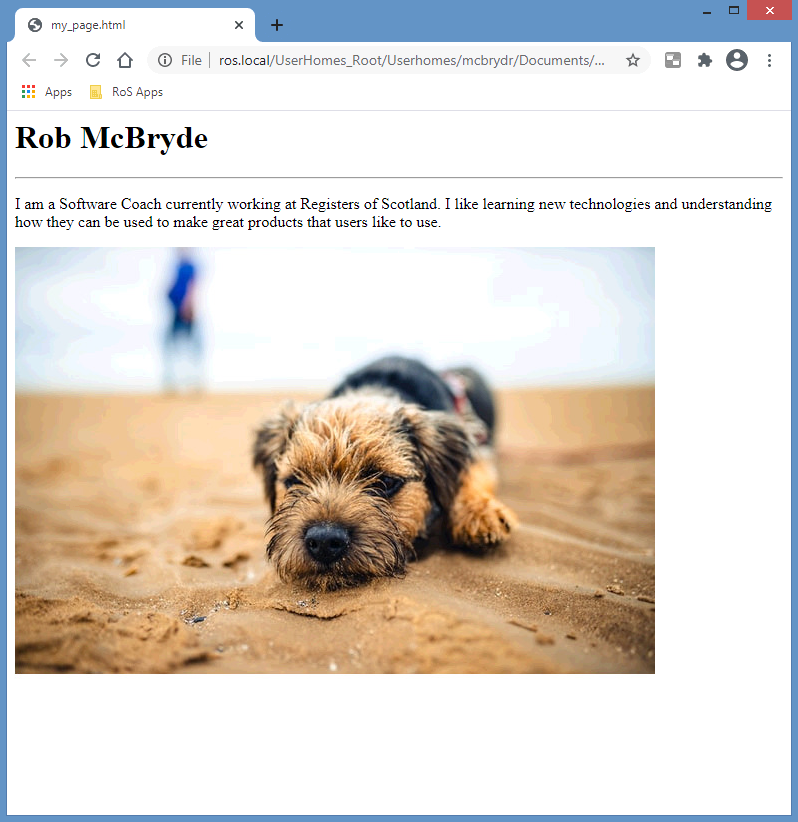
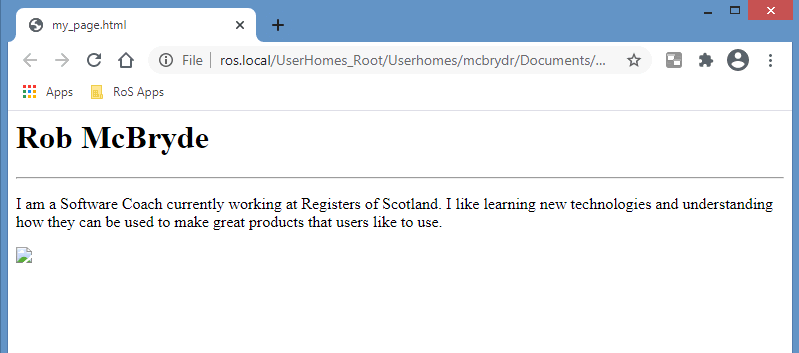

# Exercise 3 

We are now well on our way to creating our own web page! Let’s remind ourselves of what we are trying to create via our design:

  

Using what you have learned about headings so far in the previous exercise, add a heading that is smaller than `<h1>` containing ‘About me’. Position this between your horizontal rule and paragraph as seen in our design above.  


## Adding an image 

Unlike the HTML elements we have encountered so far, an image is defined outside of our web page. We reference the images in our page using the `` element. The `` element doesn’t have a closing tag but instead uses and ‘attribute’ that points to the image file. 

There is an included ‘dog.png’ image file in the exercise_3 folder we can use to practice. We have to tell our web page the location of the image relative to its location followed by the name of the image file. For example:

```html

```

From the folder location of our ‘my_page.html’ we need to instruct our image tag to look into the ‘exercise_3’ folder for the file called ‘dog.png’ via the source attribute (src). 

Try adding this to your web page code below the paragraph added in the previous exercise, and save your changes. Your web page should now resemble:

 


### Optional challenge

You can display a variety of image types in a web page, including (jpg, png, gif). If you wish to experiment, try and place an image of your choice in the ‘exercise_3’ folder and update your src attribute accordingly to reference the file name of your image (remember and include the file extension).

If you do grab an image from the web be aware that it may have very different dimensions to the 'dog.jpg' image we used. There are some additional attributes available on the `` tag called ‘height’ and ‘width’ you can experiment with to resize your image:

```html

```


---

## Troubleshooting 

If after adding the image tag you don’t see your image but instead a broken image icon, check the ‘src’ attribute of your image tag carefully:

 


Images can be one of the more complicated aspects of learning HTML as is requires us to understand the file structure surrounding our web page. The HTML code for our page is stored in ‘my_page.html’, therefore if your image is in the ‘exercise_3’ folder you need to ensure you include this is your src attribute. Check that your file location/name is surrounded by double quotes:
```html

```

### Image file extensions

Be aware that there are two valid naming conventions of jpg files. If you have included a different image that has a jpg extension, take care in case the file actually has a jpeg extension. If it does you have to ensure the src attribute of your image tag reflects this.  