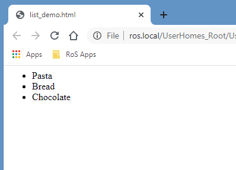

# Exercise 4

HTML allows us to specify content as lists. Let’s add a bullet point list of three of your favourite foods.

Create a new header element to describe the content of the list we are about to add below our image:

```html
<h3>My favourite foods</h3>
```

An HTML list is an example of a nested element. We create a list element via the normal ‘opening tag’ and ‘closing tag’, however, the content of the list contains a varying number of further HTML elements, each representing a single item in our list.

We can specify if we want our list to be ordered `<ol>` (numbered) or unordered `<ul>` (bullet points). Within our lists opening and closing tags we then put any number of individual list item `<li>` elements, each representing a singular item:
 
 ```html
 <ul>
	<li>Pasta</li>
	<li>Bread</li>
	<li>Chocolate</li>
</ul>
```

Would result in the following in a web browser:

 

Try adding your own list, either ordered or unordered, below your new heading in your ‘my_page.html’ file. Experiment by adding more list items of your own. 


## Troubleshooting

A common and easy mistake to make when working with HTML lists is getting the order of nested elements incorrect. Check your code carefully to ensure that you outer element that defines the whole list is either `<ol>` or `<ul>` and individual list items are the inner elements. 

(THIS IS WRONG DON’T DO THIS): 
```html
<li>
	<ul>Cheese</ul>
	<ul>Apples<ul>
</li>
```

Finally, make sure you correctly close off all of your opening list tags.