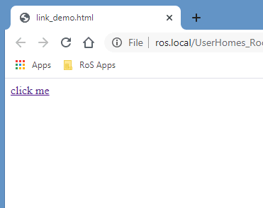
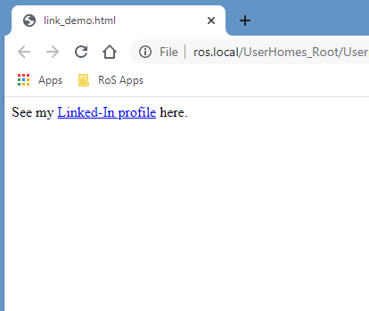
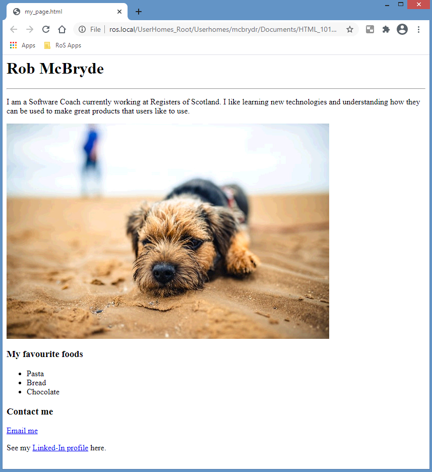

# Exercise 5

One of the most fundamental features of a web page is its ability to link to other pages and resources. We have already seen this in action when we pulled an external image we had on our machine onto our web page.

We achieved this using the `` tag with a src attribute. Links to external resources such as other web pages use a similar technique. 

Links are created with an `<a>` element which stands for “anchor”. It has an opening and closing tag that wraps our content which displays as a link on our web page. But in order to work we must also add an attribute href (Hypertext Reference) that determines where the user goes when they click our `<a>` element:

```html
<a href=”https://www.bbc.co.uk”>click me</a>
```
 


Notice that attributes live inside the opening tag. The above example is called an “Absolute” link as is used to take the user to another web page, in this example the BBC site. 

## Email links

In addition to linking to web pages you can also create a link that redirects to an email address using what’s called a “Mailto” link. 

When a user clicks on the Mailto link, the default email client on their machine opens and auto populates the email address within our links href:
```html
<a href=”mailto:robert.mcbryde@ros.gov.uk”>Email me</a>
```

Let’s update our web page to include a “Contact me” section by adding another header, followed by a Mailto link that when clicked uses your email address. 

Experiment further by using what you have learned to add a link to a website of your choice, such as your Linked-In profile. We are able to nest HTML elements inside of each other to allow us to structure our content as we wish. 

For example, we may want a paragraph of text, with one of the words in the middle, to be a link:
```html
<p>See my <a href=”https://uk.linkedin.com/in/rob-mcbryde-a008312b”
>Linked-In profile</a> here.</p>
```

 

At the end of this exercise, your web page should look something like this:
 
 