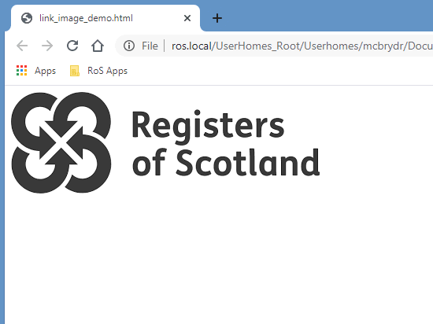
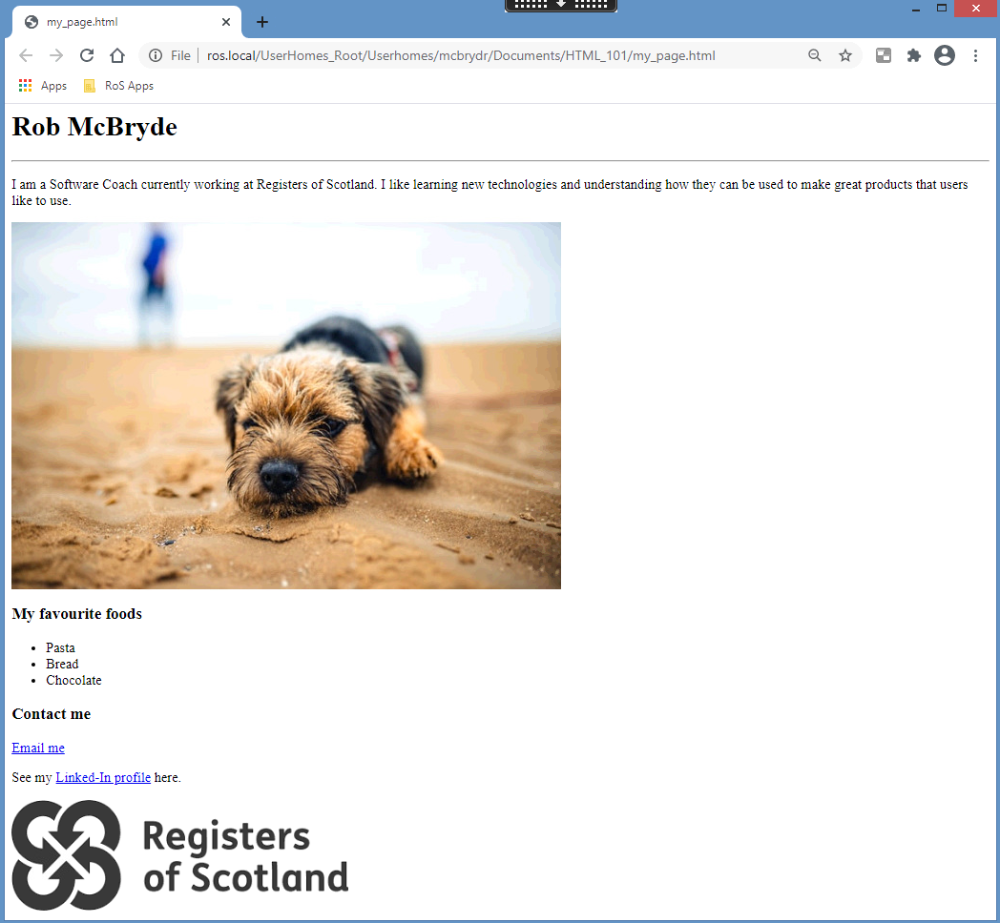

# Exercise 6

We have almost finished our first web page! 

We have learned about HTML, some of the most common elements and their associated tags. We have used nested elements, images and links. Let’s experiment some more by combining elements to include a clickable image link.  

As we saw in the last exercise, a link uses the anchor, `<a>` opening and closing tags, with the content becoming highlighted in our web browser as a clickable link:

```html
<a href=”https://www.ros.gov.uk”>click me to go to RoS website</a>
```

The content between the anchor tags doesn’t need to be text. We could also nest an image element as the content:

```html
<a href=”https://www.ros.gov.uk”></a>
```

 

There is an image file included in the “exercise_6” folder called “ros_logo.png” which we are referencing above as the content of our link. 

When a user hovers their cursor over the image it will change to a pointer to indicate it is clickable. If they click it they are taken to the RoS web page via our link.

Try adding the link image to your “my_page.html” web page:

 

## Troubleshooting 

If your image of the RoS logo is not displaying double check the src attribute of you image tag is correctly surrounded in double quotation marks and looks inside the “exercise_6” folder. 

Also check you have included the image file extension as “.png” as this image is not in the jpeg format. 

If you can see the image but are unable to click it, carefully check the order of your tags. The outer element needs to be a link and the inner element an image. The following will not work as a clickable link.

DO NOT DO THIS WILL NOT WORK:

```html
<a href="https://www.ros.gov.uk"></img>
```