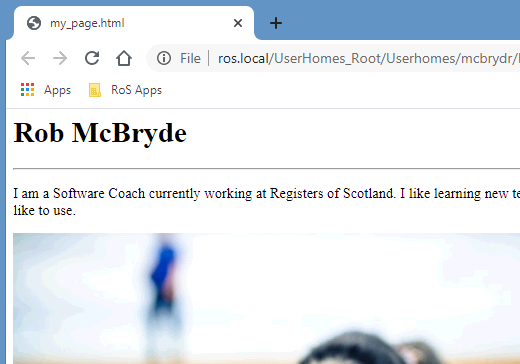
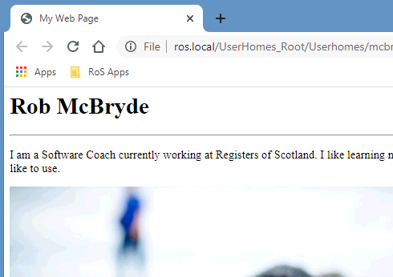

# Exercise 7

Congratulations, at this stage you have created your very own web page using HTML!

So far we have learned about marking up our content with elements to add structure that can be parsed by web browsers. Everything we have done so far has been contained within the `<body>` element which relates to the visible content in the web browser.

There is an additional element called `<head>` which stores metadata about our web page. This includes information about our page that is used by web browsers and search engines such as Google. 

There is lots more to explore and learn about such as CSS (Cascading Style Sheets) to style our web page or JavaScript to add dynamic content. 
For now let’s finish off our HTML page by adding a `<head>` element and populating it with a page title which will be displayed in the tab of our web browser.

You may have noticed, that whenever you view your HTML in a web browser, the tab contains the name of the file you are viewing:

 

This is the default behavior of the browser if we don’t provide a specific title for our page. The `<title>` element has an opening and closing tag and must reside in the `<head>` section of our webpage. The `<head>` element is nested within the `<html>` element **alongside** the `<body>`:

```html
<html>
	<head>
		<title>My Web Page</title>
	</head>
	<body>
		…
	</body>
</html>
```

Add your head element within the html element, alongside the body element, not inside it. Within your head element you can now nest a title element containing a page title of your choice. When you save your HTML and view it in a Web Browser your title should be showing in the tab:




## Completed HTML

Your completed HTML in your “my_page.html” file should now look similar to this:

```html
<html>
	<head>
		<title>My Web Page</title>
	</head>
	<body>
		<h1>Rob McBryde</h1>
		<hr>
               		 <p>I am a Software Coach currently working at Registers of Scotland. I like learning new technologies and understanding how they can be used to make great products that users like to use.</p>
		
		<h3>My favourite foods</h3>
		<ul>
			<li>Pasta</li>
			<li>Bread</li>
			<li>Chocolate</li>
		</ul>
		<h3>Contact me</h3>
		<a href="mailto:robert.mcbryde@ros.gov.uk">Email me</a>
		<p>See my <a href="https://uk.linkedin.com/in/rob-mcbryde-a008312b">Linked-In profile</a> here.</p>
		<a href="https://www.ros.gov.uk"></a>
	</body>
</html>
```

At this stage you would be ready to upload your “my_page.html” to a web server and associate it with a web address that anyone in the world can visit via their browser and see your page! 

I hope you enjoyed learning about HTML, if you have any further questions feel free to ask me robert.mcbryde@ros.gov.uk. 
